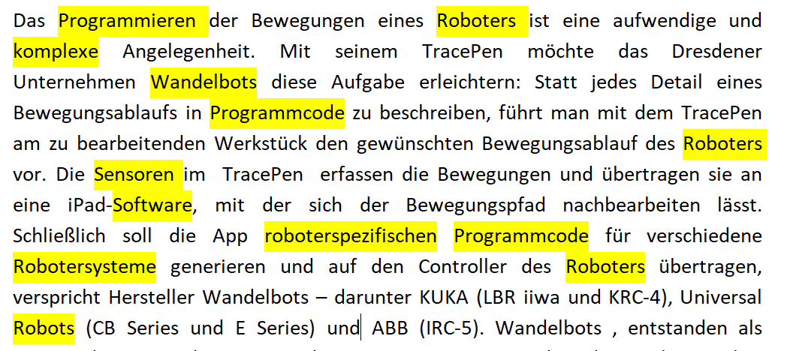
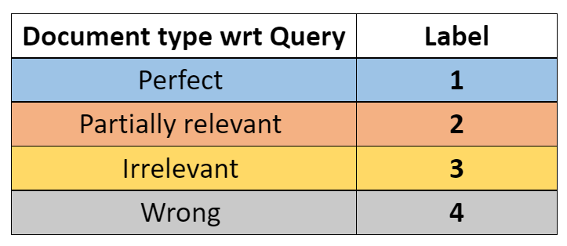

## Mitera retrieval dataset

This repository holds the retrieval dataset for Mitera. Still in progess!!.

## Getting started

1. Please refer to the below excel sheet for necessary information for retrieval labeling.

    [Retieval labels information](https://fraunhofer-my.sharepoint.com/:x:/g/personal/sri_sai_praveen_gadiyaram_fkie_fraunhofer_de/EcPjFdG9LIlHpu1BOHsjDiYB6lG8GVx0eGkqGBDHCKFevA?e=nlXHwS)
        

2. Labeling GUI is located at below URI. Visit the Raat homepage and navigate to the Relevance labelling UI by clicking on the last option "Newsfeed Search". 

    [Raat UI](http://raat.fkie.fraunhofer.de/)

## Positive Document characteristics

| S No:        | `Category Tag​`           | Category labels  |
| ------------- |:-------------:| :-----:|
| 1.     |  `I` | Innovation or Breakthrough |
| 2.       | `F`      |   Future products |
| 3. | `A`     |    Applied Research or Implementations |
| 4.       | `P`      |   New way of Procurements |
| 5. | `M`     |    Misc. (Technological advancements, Big data/AI patterns) |	

## Example news articles

 <i><b>Relevant document example</b></i>

<!-- *Relevant document example* -->

 

 <i><b>Irrelevant document example</b></i>

<!-- *Irrelevant document example* -->
 

## Dataset generation methodology: 

 <i><b>Relevance labeling pipeline</b></i>

 

Below are some important key points to consider before starting the labeling process:

`1. Once go through the above relevant document characteristics and search keywords from the above excel sheet("Suchbegriff").`

`2. Every subject needs to select a keyword from the sheet "Suchbegriff" and mark the respective column Status as "fertig" after selection. After marking the column, you can start the labeling process.`

`3. Keep in mind the search query while labeling the documents (document relevancy with respect to the search keyword is more important than the document relevancy).`

`4. Subjects are suggested to finish one-query in one-go.`

 

 <i><b>Relevance labels</b></i>

 

## Label description

1. Perfect documents

    `These retrieved documents strongly matches with one of the positive document characteristics and also contains a good coherent discussion about the user given keyword throughout the document.`

2. Partially relevant documents

    `This set of documents also contains keywords and seems to be relevant, but still lacks in innovation or novelty. However, the document shares information about some efficient or optimal way of doing things, which can be useful for MiTeRa. Must not be a clickbait!!.`

3. Irrelevant documents

    `These documents contains the given user keyword, but still lacks in innovation and coherent discussion about the query. Some example of these documents are clickbaits, advertisements, marketing blogs usw.. which contains a lot of relevant keywords at the beginning of the document, but yet not useful for MiTeRa.`

4. Wrong documents

    `These are completely false documents and has nothing to do with the given user query. Eg: for the query "Combat cloud", the documents related to cloud computing are wrong documents.`

## Dataset details

Final dataset is located at `dataset/retrieval_dataset.json`. Below are the column descriptions:
 

| S No:        | column name           | column description  |
| ------------- |:-------------:| :-----:|
| 1.     | page_id|    Unique-id of a news article |	
| 2.     |query|    Original search query |	
| 3.     | label|    Relevance label given by the labeler |	
| 4.     | text|    News article text |	
| 5.     | text_len|    length of the news article(token count) |	
| 6.     | noun_chunks|    Noun-chunks extracted from spacy |	
| 7.     | mean_nc_vec|    Mean average vector of noun-chunks(USE) |	
| 8.     | title|    Title of the news article |	
| 9.     | published_date|    Published of the news article |	
| 10.     | source_url  |    Source url of the news article |	

 
Simply load the dataset using below command: **using pandas**

`df = pd.read_json(json_filepath, lines=True)`
 

## Support
please write an email at sri.sai.praveen.gadiyaram@fkie.fraunhofer.de

## Authors and acknowledgment
	Apelt, Stefan
	Hasso, Hussein
	Moog, Manuel 
    Aymaz, Iliass
    Scheffczyk, Jan
    Zehart, Sebastian

## Project status
Currently, the dataset generation is still in development and is not finished. 